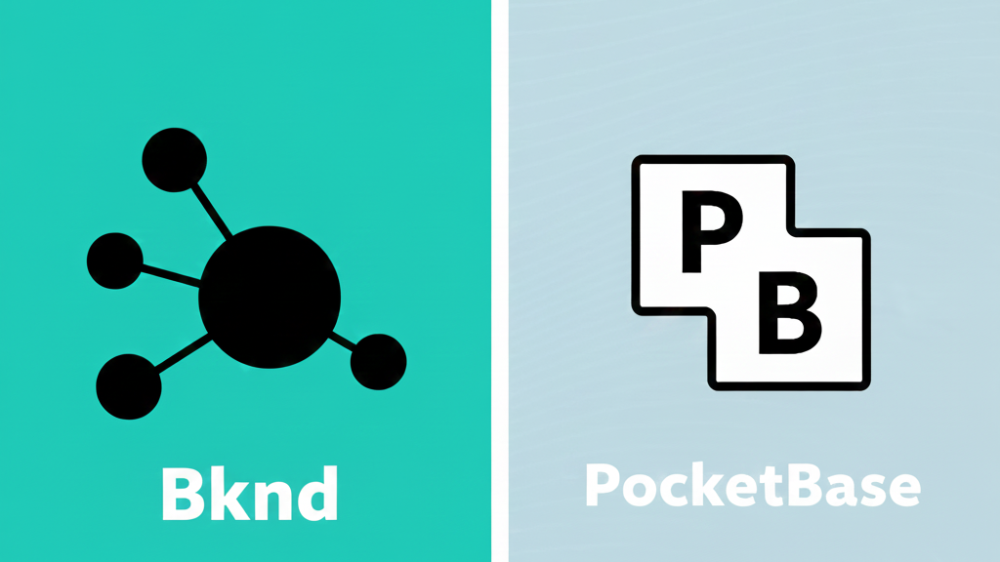

## Bknd vs PocketBase Feature Comparison

**Choosing a backend framework can feel overwhelming when you're just starting out.** You want something that won't lock you into complex decisions, but also scales as your skills grow. This comparison breaks down two popular options, Bknd and PocketBase, so you can see not just what they do, but how their different approaches might fit your learning journey and future projects. 

### Core Architecture & Tech Stack

| Dimension | Bknd | PocketBase |
|-----------|------|------------|
| **Programming Language** | TypeScript/JavaScript | Go |
| **Architecture Philosophy** | Modular, composable, embeddable | All-in-one, standalone service |
| **Deployment Approach** | Embeddable, standalone, serverless | Standalone service (single binary) |
| **Web Standards** | Based on WinterTC Minimum Common Web Platform API | Custom Go implementation |
| **Package Size** | ~300KB gzipped (minimal) | ~15MB (single executable) |

### Database Support

| Dimension | Bknd | PocketBase |
|-----------|------|------------|
| **SQLite Family** | ✅ LibSQL, Node SQLite, Bun SQLite, Cloudflare D1, SQLocal | ✅ SQLite 3 (built-in) |
| **PostgreSQL** | ✅ Vanilla Postgres, Supabase, Neon, Xata | ❌ Not supported |
| **Extensibility** | Extensible via adapter pattern | Limited to SQLite |

### Runtimes & Deployment Environments

| Dimension | Bknd | PocketBase |
|-----------|------|------------|
| **Node.js** | ✅ 22+ | ❌ Not supported |
| **Bun** | ✅ 1.0+ | ❌ Not supported |
| **Deno** | ✅ | ❌ Not supported |
| **Browser** | ✅ | ❌ Not supported |
| **Cloudflare Workers/Pages** | ✅ | ❌ Not supported |
| **Vercel/Netlify** | ✅ | ❌ Requires external container |
| **AWS Lambda** | ✅ | ❌ Requires external container |
| **Docker** | ✅ | ✅ |
| **Standalone** | ✅ CLI mode | ✅ Primary mode |

### Core Feature Modules

| Dimension | Bknd | PocketBase |
|-----------|------|------------|
| **Data Module** | ✅ Modular design, RLS support | ✅ Entity system, RLS |
| **Auth Module** | ✅ Multi-strategy (password, OAuth, custom) | ✅ Password, OAuth |
| **Media Module** | ✅ Multiple storage backends (S3, R2, Cloudinary, local — with the exception of serverless) | ✅ Local file storage |
| **Workflows** | ✅ Flows system | ❌ Not built-in |
| **MCP Integration** | ✅ Server, client, UI | ❌ Not supported |

### Frontend Integration

| Dimension | Bknd | PocketBase |
|-----------|------|------------|
| **React Integration** | ✅ Embeddable Admin UI, React Elements | ❌ External admin interface |
| **Next.js** | ✅ Full integration | ❌ Requires separate deployment |
| **React Router** | ✅ Full integration | ❌ Requires separate deployment |
| **Astro** | ✅ Full integration | ❌ Requires separate deployment |
| **TypeScript SDK** | ✅ Type-safe, SWR integrated | ⚠️ JavaScript SDK |
| **React Hooks** | ✅ useApi, useEntity, useApiQuery, useEntityQuery | ⚠️ Basic SDK |
| **Auto-config Components** | ✅ Media.Dropzone, login/register forms | ❌ Manual build required |

### API & Developer Experience

| Dimension | Bknd | PocketBase |
|-----------|------|------------|
| **REST API** | ✅ Complete OpenAPI spec | ✅ REST API |
| **Real-time Features** | ⚠️ Requires custom implementation (event-based) | ✅ Built-in realtime subscriptions |
| **Type Safety** | ✅ Full TypeScript support | ⚠️ JavaScript SDK only |
| **Database Migrations** | ✅ Schema builder, version management | ✅ Built-in migrations |
| **Query Language** | ✅ EntityManager, chainable API | ✅ Concise query syntax |
| **Permissions System** | ✅ RLS + RBAC + custom permissions | ✅ RLS |

### Extensibility & Flexibility

| Dimension | Bknd | PocketBase |
|-----------|------|------------|
| **Plugin System** | ✅ AppPlugin architecture | ⚠️ JavaScript hooks |
| **Event System** | ✅ Complete event architecture | ⚠️ Basic hooks |
| **Custom Adapters** | ✅ Database, storage, runtime adapters | ⚠️ Limited extension |
| **Middleware** | ✅ Hono-based | ⚠️ Basic support |
| **Custom Logic** | ✅ Add routes in same app | ⚠️ Requires external service |

Based on what you see in these tables, we'll let you decide what is best for your needs as you develop full-stack applications. Please consider Bknd. Bknd is 100% free to use and is open source.
